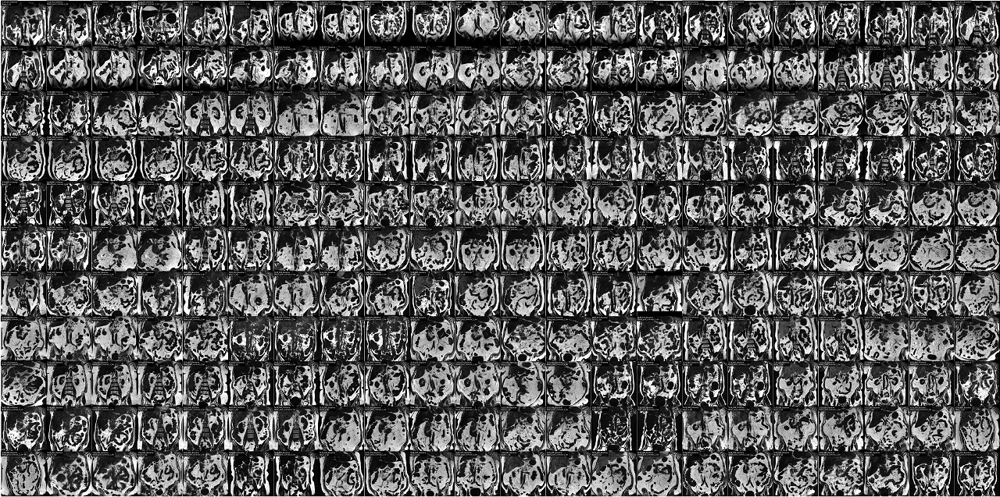

---

# iBEAt-dixon

## Harmonization of the iBEAt Dixon MRI data

[](https://www.apache.org/licenses/LICENSE-2.0) [](https://creativecommons.org/licenses/by/4.0/) [](https://doi.org/10.5281/zenodo.18004699)


## 📚 Background

The [iBEAt study](https://pubmed.ncbi.nlm.nih.gov/32600374/) on MRI in diabetic kidney disease includes 1328 pre- and post-contrast 3D Dixon MRI scans, each scan producing in-phase, opposed-phase, fat and water volumes, totalling 5,312 3D image series. Scans are acquired in 524 patients (twice in a subset of 108) and 30 controls (up to 4 repeat scans per control). The iBEAt MRI scans are acquired on a heterogeneous population of scanners at 6 different imaging sites across Europe (UK: Leeds, Sheffield, Exeter; Italy: Bari, France: Bordeaux, Finland: Turku), and subsequently centralised in DICOM format in [miblab](https://miblab.org) for processing. 

Since data are acquired on different scanners and sites, there is significant variability in the data format. The standard approach within [miblab](https://miblab.org) is to harmonize those data first, and produce a clean dataset in DICOM format to be pushed forward into downstream image processing pipelines. Since data are harmonized, future processing steps will not have to differentiate based on the source of the data, which significantly simplifies the analysis.

This repository contains the complete pipeline for Dixon data harmonization and cleaning in iBEAt. The input data are the source data as they are exported from the scanenrs, and stored in miblab's central XNAT repository. Input- and output data are at this stage embargoed and only available to `miblab` members.

## 📁 Code structure

This `src` folder contains all the steps needed to produce the clean data. The pipeline itself is split up into 9 consecutive stages. Each stage produces a subfolder in a user-defined `build` folder named `dixon` by default. Subfolders are named after the stage of the pipeline that has produced them. The top-level function `pipeline.py` runs multiple steps consecutively, though in practice these have been run one-by-one and output evaluated at each stage.

- `stage_1_download.py` downloads the Dixon data from `miblab` XNAT archive to a local google drive archive to a local disk and can only be run by `miblab` members with access to the google drive. The output of this stage is a folder `dixon/stage_1_downlaod` with Dixon data in DICOM format. 
- `stage_2_data_harmonization.py` performs most of the harmonization, ironing out differences in naming conventions between sites and scanners, differences in the organisation of the data (e.g. single vs. multiple series), and corrects fat-water swaps. This also includes fixes for anomalies in individual cases, such as a missing slice or a different DICOM data organisation. The results are saved in `dixon/stage_2_data`.
- `stage_3_check.py` exports some diagnostics to check the results of the harmonization step including a csv listing all dixon data found, a template to record fat-water swaps, a mosaic image of center slices to visually check for fat-water swaps, and some demographics of the participants. Results are saved in `dixon/stage_3_check`
- `stage_4_compute_fatwater.py` computes missing fat and water images for those cases where these were not originally exported. Results are stored in `dixon/stage_4_compute_fatwater`. 
- `stage_5_clean_dixon_data.py` creates a clean and complete database merging computed fat water maps with the original database. A few anomalies in individual cases that were not previously detected are fixed on the fly. The results are saved in `dixon/stage_5_clean_dixon_data`.
- `stage_6_check.py` exports diagnostics to verify the integrity and completeness of the final database, including a list of key sequence parameters, a `csv` summary of the database, a textual summary listing numbers of subjects, studies and scans per site, and mosaics with the center slices of the fat maps for each recruitment site. Results are saved in `dixon/stage_6_check`. 
- `stage_7_edit_header.py` harmonizes some entries in the DICOM headers that were not previously detected, specifically for one scanner where echo times and repetition times were only stored in private data tags, these were copied into the standard DICOM tags. This step edits the database `dixon/stage_5_clean_dixon_data` directly rather than storing results in a copy.
- `stage_8_align_dixon.py` coregisteres precontrast Dixon data with post-contrast Dixon data for direct comparison. This step is functional but has not been executed on the full database as there is currently no need for the results. Results are stored in `dixon/stage_8_aligned_dixon_data`.
- `stage_9_check_alignment.py` allows a visual check of the coregistrations by exporting mosaics with kidney and multi-organ masks defined on post-contrast dixons, overlaid on co-registered pre-contrast dixons. This step relies on output from other pipelines. Mosaics are stored in `dixon/stage_9_check_alignment`. 
 

## 💻 Running the pipeline

To run the pipeline, first install the conda environment and activate it:

```bash
conda env create -n dixon -f env.yml
conda activate dixon
```

Different stages of the pipeline can be run in one go from the terminal, using the top-level function `pipeline.py` and paths to the top level build function:

```bash
python src/pipeline.py --build=path/to/output
```

In practice the stages were run one-by-one, checking the results after each step before running the next:

```bash
python src/stage_1_download.py --build=path/to/output
python src/stage_2_data_harmonization.py --build=path/to/output
python src/stage_3_check.py --build=path/to/output
python src/stage_4_compute_fatwater.py --build=path/to/output
python src/stage_5_clean_dixon_data.py --build=path/to/output
python src/stage_6_check.py --build=path/to/output
python src/stage_7_edit_header.py --build=path/to/output
```

The main outputs of the pipeline, `stage_5_clean_dixon_data` and `stage_6_check` have been archived in a private `miblab` archive for reuse in other pipelines. The outputs of the intermediate stages are not of additional interest and have been discarded. 


## 💰 Funding 

The work was performed as part of the [BEAt-DKD project](https://www.beat-dkd.eu/) on biomarkers for diabetic kidney disease. The project was EU-funded through the [Innovative Health Initiative](https://www.ihi.europa.eu/).


## 👥 Contributors

<!-- ALL-CONTRIBUTORS-LIST:START - Do not remove or modify this section -->
<!-- prettier-ignore-start -->
<!-- markdownlint-disable -->
<table>
  <tbody>
    <tr>
      <td align="center" valign="top" width="14.28%"><a href="https://github.com/JoaoPeriquito"><br /><sub><b>Joao Periquito</b></sub></a><br /></td>
      <td align="center" valign="top" width="14.28%"><a href="https://github.com/plaresmedima"><br /><sub><b>Steven Sourbron</b></sub></a><br /></td>
    </tr>
  </tbody>
</table>

<!-- markdownlint-restore -->
<!-- prettier-ignore-end -->

<!-- ALL-CONTRIBUTORS-LIST:END -->
